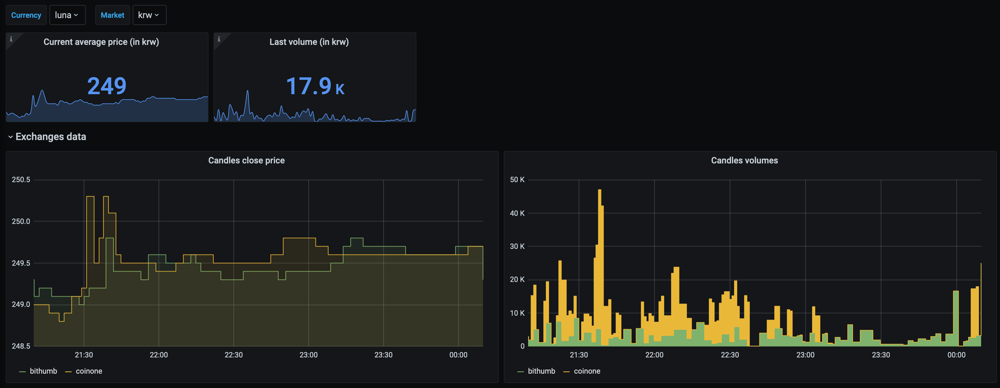

# exchange-price-exporter



<a href="../../actions"></a>
<a href="https://hub.docker.com/repository/docker/settenio/exchange-price-exporter"></a>
<a href="LICENSE"></a>
<a href="https://github.com/psf/black"></a>

Prometheus blockchain exchange price exporter


## Usage

```
Usage: exchange-price-exporter [OPTIONS]

  Exchange price exporter.

Options:
  -c FILE    TOML config file.
  --version  Show the version and exit.
  --help     Show this message and exit.
```

## Installation

### Docker

A docker image is available on docker hub.

The default location for the config file is under `/app/config.toml`.

```
docker run \
  -v myconfig.toml:/app/config.toml \
  -p 8000:8000 \
  settenio/exchange-price-exporter:<VERSION>
```

You can then access the exported metrics at http://localhost:8000

## Configuration

Configured via a toml file, use `./config.toml` if the `-c` flag is not set

```toml
[server]
port=8000  # int, default: 8000

[log]
debug=true  # bool, default: false

[exporter]
interval=1  # int, default: 1 (minutes)
start_at_second=30  # int, default: 30 (will run at 01:30, 02:30, 03:30, etc.)
threads=8  # int, default: 8

[[exporter.pairs]]
exchange="coinone"
currency="luna"
market="krw"

[[exporter.pairs]]
exchange="bithumb"
currency="luna"
market="btc"
```

If an exporter pair doesn't exist on the exchange, all olhcv data will be `NaN`.

## Exported metrics

## Gauge `candle`

Example:

```node
candle{currency="luna",exchange="bithumb",market="krw",olhcv="close"} 4620.6
```

### Labels

| Name       | Values                                               |
|------------|------------------------------------------------------|
| `currency` | Pair currency for this candle                        |
| `exchange` | Exchange for this candle                             |
| `market`   | Pair market for this candle                          |
| `market`   | Pair market for this candle                          |
| `olhcv`    | one of candle's `open` `low` `high` `close` `volume` |

## Exchanges

Available exchanges:

- [Coinone](https://coinone.co.kr/) - `coinone`
- [Bithumb global](https://bithumb.com) - `bithumb`
- [Kucoin](https://www.kucoin.com/) - `kucoin`

## Others

In the assets folder, you can find some useful files such as:

- A grafana dashboard ready to import
- A prometheus target config example
